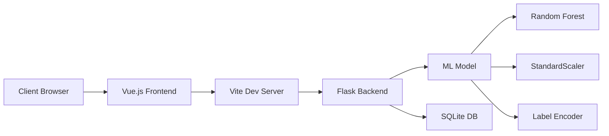

<div align="center">

# ️ CyberDefense IDS Shield

### Real-time DDoS Detection System with Machine Learning

[](https://www.python.org/downloads/)
[](https://vuejs.org/)
[](https://flask.palletsprojects.com/)
[](https://www.typescriptlang.org/)
[](LICENSE)

[Features](#-features) • [Quick Start](#-quick-start) • [API Documentation](#-api-documentation) • [Performance](#-performance-metrics) • [Architecture](#-architecture)

</div>

---

## Features

- ** High Accuracy Detection**: 99.93% accuracy in detecting DDoS attacks
- ** Real-time Analysis**: Instant network traffic classification
- ** Interactive Dashboard**: Modern Vue.js frontend with live metrics
- ** Continuous Learning**: Support for model retraining with new data
- ** RESTful API**: Easy integration with existing systems
- ** Visual Analytics**: Comprehensive charts and statistics
- ** Multi-class Detection**: Identifies various DDoS attack types (Hulk, Slowloris, GoldenEye, etc.)

## Performance Metrics

<div align="center">

| Metric | Score |
|--------|-------|
| **Accuracy** | 99.93% |
| **Precision** | 99.93% |
| **Recall** | 99.93% |
| **False Positive Rate** | 0.05% |
| **AUC-ROC** | 99.99% |

</div>

## Quick Start

### Prerequisites

```bash
# Required software
Python 3.8+
Node.js 16.x+
npm 8.x+
Git
```

###  Installation & Setup

#### 1 Clone the Repository

```bash
git clone https://github.com/yourusername/SCC252.git
cd SCC252
```

#### 2 Backend Setup (Python/Flask)

<details>
<summary><b>Step-by-step Backend Configuration</b></summary>

##### Create Virtual Environment

**On macOS/Linux:**
```bash
python3 -m venv venv
source venv/bin/activate
```

**On Windows:**
```bash
python -m venv venv
venv\Scripts\activate
```

##### Install Python Dependencies

```bash
pip install -r requirements.txt
```

<details>
<summary>View key dependencies</summary>

- `Flask` - Web framework
- `Flask-CORS` - Cross-origin support
- `scikit-learn` - Machine learning
- `pandas` - Data manipulation
- `numpy` - Numerical computing
- `joblib` - Model serialization

</details>

</details>

#### 3 Prepare Training Data

##### Download Dataset

> **Dataset**: CICIDS2017 (Wednesday Working Hours Traffic)  
> **Source**: [Canadian Institute for Cybersecurity](https://www.unb.ca/cic/datasets/ids-2017.html)  
> **Required File**: `Wednesday-workingHours.pcap_ISCX.csv`

##### Place Dataset

```bash
mkdir -p data
# Place Wednesday-workingHours.pcap_ISCX.csv in the data/ directory
```

**Expected file structure:**
```
SCC252/
├── data/
│   └── Wednesday-workingHours.pcap_ISCX.csv
```

#### 4 Train the Model

```bash
python trainning.py
```

<details>
<summary>Expected output</summary>
```
Data is being read...
Data reading is successful. Original shape: (692703, 79)
Data cleaning is underway...
Cleaned shape: (692703, 79)
Multiclass label encoding is in progress... ...
Overall accuracy of the test set: 0.9993
Overall precision of the test set: 0.9993
Recall rate of the test set [BENIGN]: 0.9993
False positive rate of the test set: 0.0005
AUC of the test set: 0.9999
Task completed!
```

**Generated files in `models/` directory:**
- `ddos_rf_model.joblib` - Trained Random Forest model
- `ddos_scaler.joblib` - StandardScaler for feature normalization
- `ddos_label_encoder.joblib` - Label encoder for attack types
- `ddos_feature_columns.joblib` - List of feature column names
- `ddos_performance.json` - Performance metrics

</details>

#### 5 Start Backend Server

```bash
python app.py
```

**Expected output:**
```
INFO:werkzeug:WARNING: This is a development server.
 * Running on http://127.0.0.1:5050
INFO:app: Model components loaded successfully.
INFO:app: Performance metrics loaded.
```

**Verify backend is running:**
```bash
curl http://127.0.0.1:5050/health
# Expected: {"status":"healthy","model_loaded":true}
```

#### 6 Frontend Setup (Vue.js)

##### Navigate to Frontend Directory

```bash
cd template
```

##### Install Node Dependencies

```bash
npm install
```

##### Start Development Server

```bash
npm run dev
```

**Expected output:**
```
VITE v6.2.0  ready in 500 ms

➜  Local:   http://localhost:5173/
➜  Network: use --host to expose
```

#### 7 Access the Application

 **Frontend**: Open browser and navigate to `http://localhost:5173`  
 **Backend API**: `http://127.0.0.1:5050`

**Dashboard Features:**
-  Performance metrics visualization
-  Real-time detection interface
-  Alert history panel
-  Model statistics radar chart

#### 8 Verify Setup

##### Test Prediction Endpoint

```bash
curl -X POST http://127.0.0.1:5050/api/predict \
  -H "Content-Type: application/json" \
  -d '{"features": [54865,3,2,0,12,0,6,6,6.0,0.0,0,0,0.0,0.0,4000000.0,666666.6667,3.0,0.0,3,3,3,3.0,0.0,3,3,0,0.0,0.0,0,0,0,0,0,0,40,0,666666.6667,0.0,6,6,6.0,0.0,0.0,0,0,0,0,1,0,0,0,0,9.0,6.0,0.0,40,0,0,0,0,0,0,2,12,0,0,33,-1,1,20,0.0,0.0,0,0,0.0,0.0,0,0]}'
```

##### Run Example Script

```bash
cd examples
python run_sample.py
```

**Expected output:**
```
--- Simulated website/API interface return results ---
{
    "status": "success",
    "predicted_label": "BENIGN",
    "confidence": 0.98,
    "threat_level": "None",
    ...
}
```

---

##  Usage Guide

###  Running Sample Detection

```bash
cd examples
python run_sample.py
```

###  Making Predictions via API

```python
import requests

# Prepare feature data (78 features required)
features = [54865, 3, 2, 0, 12, ...] # 78 values

# Send prediction request
response = requests.post(
    'http://127.0.0.1:5050/api/predict',
    json={'features': features}
)

result = response.json()
print(f"Prediction: {result['predicted_label']}")
print(f"Confidence: {result['confidence']}")
print(f"Threat Level: {result['threat_level']}")
```

###  Retraining the Model

```bash
# Upload new CSV data via web interface
# Or use API:
curl -X POST http://127.0.0.1:5050/api/upload-and-retrain \
  -F "files=@new_data.csv"
```

###  Viewing Detection History

Access the frontend dashboard at `http://localhost:5173` to view:
- Real-time attack detection
- Historical alerts
- Model performance metrics
- Attack frequency analysis

---

##  API Documentation

###  Endpoints Overview

| Method | Endpoint | Description |
|--------|----------|-------------|
| GET | `/health` | Health check |
| POST | `/api/predict` | Classify network traffic |
| GET | `/api/alerts` | Get recent alerts |
| GET | `/api/history` | Get detection history |
| GET | `/api/performance` | Get model metrics |
| GET | `/api/stream` | Get attack stream samples |
| GET | `/api/random` | Generate random test data |
| POST | `/api/upload-and-retrain` | Retrain model with new data |

###  Detailed API Reference

#### `POST /api/predict`

Classify network traffic features.

**Request:**
```json
{
  "features": [78 numerical values]
}
```

**Response:**
```json
{
  "status": "success",
  "predicted_label": "DoS Hulk",
  "confidence": 0.95,
  "threat_level": "High",
  "probabilities": {
    "DoS Hulk": 0.95,
    "BENIGN": 0.03,
    "DoS Slowloris": 0.02
  },
  "timestamp": "2025-12-14 10:30:45"
}
```

#### `GET /api/performance`

Get current model performance metrics.

**Response:**
```json
{
  "accuracy": 0.9993,
  "precision": 0.9993,
  "recall": 0.9993,
  "FPR": 0.0005,
  "auc": 0.9999
}
```

---

## 🏗 Architecture

### System Architecture



### Technology Stack

**Backend**
- Python 3.8+
- Flask (REST API)
- scikit-learn (ML)
- pandas & numpy (Data processing)

**Frontend**
- Vue.js 3.x
- TypeScript
- Vite (Build tool)
- Chart.js (Visualizations)

**ML Pipeline**
- Random Forest Classifier
- StandardScaler normalization
- Multi-class classification
- CICIDS2017 dataset

##  Project Structure

```
SCC252/
├── app.py                          # Flask backend server
├── trainning.py                    # Model training script
├── requirements.txt                # Python dependencies
├── README.md                       # This file
├── data/                           # Training datasets
│   └── Wednesday-workingHours.pcap_ISCX.csv
├── models/                         # Trained model files
│   ├── ddos_rf_model.joblib
│   ├── ddos_scaler.joblib
│   ├── ddos_label_encoder.joblib
│   ├── ddos_feature_columns.joblib
│   └── ddos_performance.json
├── examples/                       # Usage examples
│   ├── run_sample.py
│   └── retrain_with_new_data.py
├── template/                       # Vue.js frontend
│   ├── components/
│   │   ├── RadarChart.vue
│   │   └── StatCard.vue
│   ├── services/
│   │   └── api.ts
│   ├── App.vue
│   ├── main.ts
│   ├── package.json
│   └── vite.config.ts
└── ddos_detection.db              # SQLite database
```

---

##  Contributing

Contributions are welcome! Please feel free to submit a Pull Request.

1. Fork the repository
2. Create your feature branch (`git checkout -b feature/AmazingFeature`)
3. Commit your changes (`git commit -m 'Add some AmazingFeature'`)
4. Push to the branch (`git push origin feature/AmazingFeature`)
5. Open a Pull Request

##  License

This project is licensed under the MIT License - see the [LICENSE](LICENSE) file for details.

##  Acknowledgments

- **Dataset**: [CICIDS2017](https://www.unb.ca/cic/datasets/ids-2017.html) by Canadian Institute for Cybersecurity
- **ML Framework**: [scikit-learn](https://scikit-learn.org/)
- **Frontend Framework**: [Vue.js](https://vuejs.org/)

##  Contact

For questions or feedback, please open an issue on GitHub.

---

<div align="center">

** Star this repository if you find it helpful!**


</div>